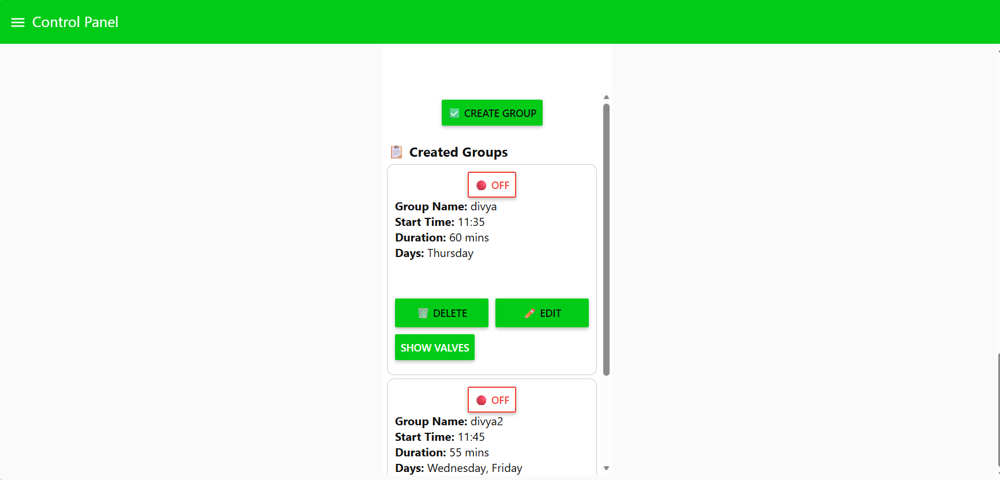
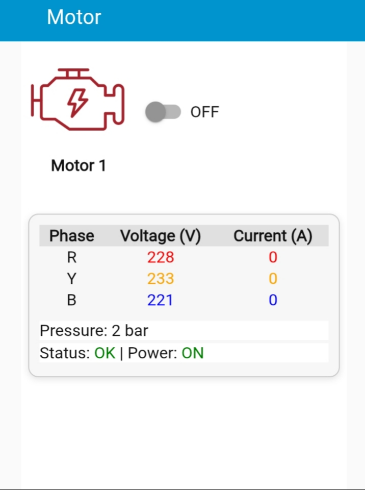
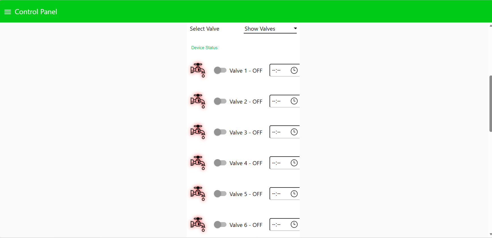
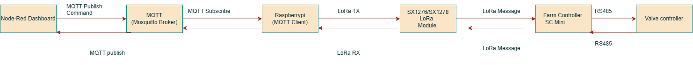

# Remote IoT Dashboard using Raspberry Pi & Node-RED

## Overview

This project is a Raspberry Pi-based remote IoT monitoring and control dashboard developed using Node-RED.

The system enables users to monitor and control connected IoT devices through a web-based interface. Node-RED running on Raspberry Pi acts as the edge application layer, handling device communication, automation logic, command processing, and real-time dashboard updates.

The solution provides secure remote access using Cloudflare Tunnel, allowing users to access the dashboard from anywhere without requiring router port forwarding.

Device status updates are processed directly through communication responses and maintained using Node-RED context storage for real-time visualization without API polling.

---

## Features

### Remote Device Control
- Remote ON/OFF control for connected devices.
- Valve and motor control through Node-RED dashboard.
- User-friendly web interface for device operation.

### Real-Time Monitoring
- Live device status monitoring.
- Real-time dashboard updates based on received device data.
- Maintains latest device states using Node-RED context storage.

### Node-RED Automation
- Developed Node-RED workflows for:
  - Device communication
  - Command processing
  - Automation logic
  - Dashboard visualization

### MQTT Communication
- Implemented MQTT-based messaging for IoT device communication.
- Supports publish and subscribe based command handling.
- Processes device commands and status messages.

### Remote Access
- Configured Cloudflare Tunnel for secure remote dashboard access.
- Enables access from anywhere without public IP configuration or port forwarding.

---

## Technologies Used

### Hardware / Edge Platform
- Raspberry Pi
- IoT Communication Modules
- Connected Field Devices

### Software & Communication
- Node-RED
- MQTT
- JavaScript
- Python
- Cloudflare Tunnel

### Data & Monitoring
- Node-RED Dashboard
- Node-RED Context Storage

---

## Project Structure
Remote-IoT-Dashboard

├── Node-RED
│ └── flows.json
├── Python
│ └── irrigation_controller.py
│
├── Screenshots
│ ├── motor-group-control.png
│ ├── motor-monitoring.jpeg
│ └── valve-control.png
│
├── Documentation
│ ├── architecture.pdf
│ └── mqtt-communication-flow.png
│
└── README.md
---

# Node-RED Flow

The Node-RED flow is responsible for:

- MQTT message processing
- Device command handling
- Motor and valve control logic
- Automation workflows
- Dashboard data processing
- Real-time device status updates

Node-RED flow file:

## Python IoT Controller

A Raspberry Pi based Python controller is used for field device automation.

Responsibilities:
- LoRa based motor and valve communication
- MQTT message handling
- Cyclic irrigation scheduling
- Automatic ON/OFF control
- Telegram based event notifications
- Device response handling

# Dashboard Screenshots

## Motor Group Scheduling

This section provides motor scheduling and automation features.

## Motor Monitoring & Control

Features:
- Motor status monitoring
- Voltage monitoring
- Current monitoring
- Remote control

## Valve Control

Features:
- Remote valve operation
- Device status feedback

---

# Remote Access

Cloudflare Tunnel is used to provide secure remote access to the Raspberry Pi hosted dashboard without router port forwarding.

## System Architecture

The system architecture describes the remote access and IoT communication flow.

Users can access the dashboard from anywhere through a GitHub Pages web application. The Cloudflare Tunnel provides secure access to the Node-RED dashboard running on Raspberry Pi.

The active tunnel URL is stored in Firebase Realtime Database and retrieved by the web application.

## MQTT Communication Flow

Node-RED handles device control, LoRa communication, MQTT messaging, and real-time dashboard updates. Device status is directly updated through LoRa communication without API polling.

### Architecture Diagram

[View Architecture Diagram](Documentation/architecture.pdf)
